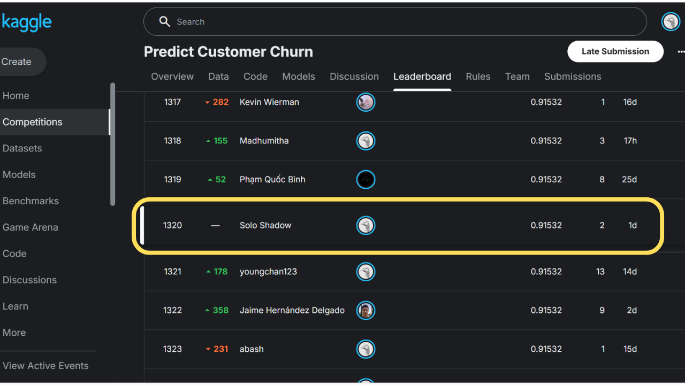

# 📉 Customer Churn Prediction — Kaggle Competition


> A machine learning project to predict whether a customer will churn (leave a service), built as part of the **Kaggle Playground Series S6E3 — Predict Customer Churn** competition. Uses an ensemble of **CatBoost, LightGBM (DART & GBDT), and XGBoost** with Optuna-based hyperparameter tuning.

---

## 🏆 Leaderboard



> 📌 Competed solo as **Solo Shadow** — Public Score: **0.91532**  
> [](https://www.kaggle.com/competitions/playground-series-s6e3)
> [](https://www.kaggle.com/anishraj07)

---

## 🧠 Problem Statement

Customer churn — when a customer stops using a company's product or service — is one of the most critical business problems across telecom, banking, SaaS, and e-commerce industries. Retaining an existing customer costs significantly less than acquiring a new one.

This project builds a **binary classification model** that predicts the probability of a customer churning, enabling businesses to take proactive retention measures.

---

## 📁 Project Structure

```
CHURN-S6E3/
│
├── images/
│   └── kaggle-ss.png                 # Leaderboard screenshot
│
├── data/
│   ├── train.csv                     # Training dataset
│   ├── test.csv                      # Test dataset
│   └── sample_submission.csv         # Submission format
│
├── notebooks/
│   ├── 01_eda.ipynb                  # Exploratory Data Analysis
│   ├── 02_features.ipynb             # Feature Engineering
│   └── 03_model.ipynb                # Model Training & Evaluation
│
├── src/
│   ├── features.py                   # Feature engineering pipeline
│   └── train.py                      # Core training logic
│
├── oof/
│   ├── oof_cat.npy                   # Out-of-fold predictions — CatBoost
│   ├── oof_lgb_dart.npy              # Out-of-fold predictions — LGB DART
│   ├── oof_lgb_gbdt.npy              # Out-of-fold predictions — LGB GBDT
│   └── oof_xgb.npy                   # Out-of-fold predictions — XGBoost
│
├── submissions/
│   ├── baseline_lgbm.csv
│   ├── sub_v3_cat.csv
│   ├── sub_v3_ens_optrank.csv
│   ├── sub_v3_ens_optuna_BEST.csv    # ✅ Best submission
│   ├── sub_v3_ens_rank.csv
│   ├── sub_v3_ens_simple.csv
│   ├── sub_v3_lgb_dart.csv
│   ├── sub_v3_lgb_gbdt.csv
│   └── sub_v3_xgb.csv
│
├── catboost_info/                    # CatBoost training logs
├── train_v3.py                       # Training script v3
├── train.py                          # Base training script
├── final_push.py                     # Final submission script
├── requirements.txt
└── README.md
```

---

## ⚙️ Tech Stack

| Category | Tools |
|---|---|
| **Language** | Python 3.10+ |
| **Data Processing** | Pandas, NumPy |
| **Visualization** | Matplotlib, Seaborn |
| **ML Models** | CatBoost, LightGBM (DART & GBDT), XGBoost |
| **Tuning** | Optuna (Bayesian Hyperparameter Optimization) |
| **Evaluation** | ROC-AUC, OOF Score, Stratified K-Fold |
| **Environment** | VS Code + Jupyter Notebooks |

---

## 🔍 Approach

### 1. Exploratory Data Analysis (`01_eda.ipynb`)
- Analyzed feature distributions and class imbalance
- Identified correlations between features and churn behavior
- Visualized churn rates across customer segments

### 2. Feature Engineering (`02_features.ipynb` / `features.py`)
- Handled missing values and outliers
- Encoded categorical variables
- Created interaction features and ratio-based features

### 3. Modeling (`03_model.ipynb` / `train_v3.py`)
- Trained **4 individual models**: CatBoost, LightGBM DART, LightGBM GBDT, XGBoost
- Generated **Out-of-Fold (OOF) predictions** for each model to prevent data leakage
- Used **Optuna** for automated hyperparameter tuning

### 4. Ensembling
- Tried multiple strategies: simple average, rank averaging, Optuna-optimized blending
- Best result achieved with **Optuna-optimized ensemble** (`sub_v3_ens_optuna_BEST.csv`)

---

## 📊 Model Comparison

| Model | Strategy |
|---|---|
| LightGBM GBDT | Gradient Boosted Decision Trees |
| LightGBM DART | Dropout Additive Regression Trees |
| CatBoost | Categorical Boosting |
| XGBoost | Extreme Gradient Boosting |
| **Optuna Ensemble** ✅ | **Weighted blend — Best Score** |

---

## 🚀 Getting Started

```bash
# Clone the repo
git clone https://github.com/im-anishraj/customer-churn-prediction.git
cd customer-churn-prediction

# Install dependencies
pip install -r requirements.txt
```

> **Note:** Download the dataset from the [Kaggle competition page](https://www.kaggle.com/competitions/playground-series-s6e3) and place files inside the `data/` folder.

```bash
# Run training pipeline
python train_v3.py

# Generate final submission
python final_push.py
```

---

## 📈 Key Learnings

- Optuna-based ensemble weights consistently outperformed manual blending
- OOF-based stacking is a reliable way to evaluate ensemble quality without leaking test labels
- DART boosting in LightGBM helped reduce overfitting compared to standard GBDT
- Diverse base models (different algorithms) improve ensemble performance more than similar models

---

## 🤝 Acknowledgements

- [Kaggle](https://www.kaggle.com/) for hosting the competition and dataset
- The open-source ML community for CatBoost, LightGBM, XGBoost, and Optuna

---

## 📬 Connect with Me

[](https://github.com/im-anishraj)
[](https://www.kaggle.com/anishraj07)
[](https://linkedin.com/in/im-anishraj)

---

⭐ *If you found this project useful or interesting, consider giving it a star!*